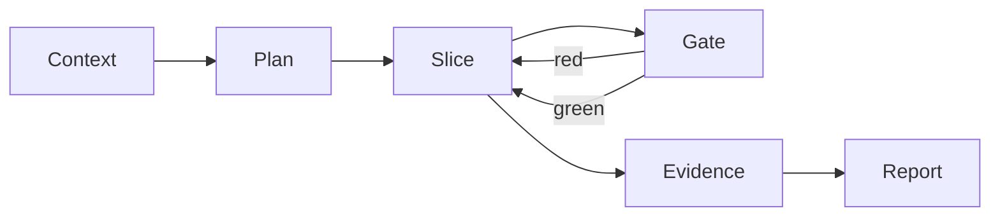

# Proof mode — overview

> **Purpose.** This skill runs a task. `turystack-harness` decides whether the
> project is ready for one and which task it is, `turystack-architecture-pattern`
> decides which law applies, the stack skills decide how the code is written, and
> `@turystack/proof-mode-gates` decides what a check actually runs. Nothing here
> restates any of them.

**Rules defined here:** none — every rule this file states is defined
elsewhere and cited by id.

## Mental model

- **Context** is what the task is built on. Five inputs, each with a location.
- **Plan** turns the request into specs and names the laws that will apply.
- **Slice** is the smallest change that can be proven on its own.
- **Gate** is the ladder, run after every slice — not once at the end.
- **Evidence** is what a reader needs to believe the task is done without
  redoing it.
- **Report** is the single artifact handed over.

The arrow from Gate back to Slice is the whole point. A red rung on a slice you
just wrote points at ten lines. The same rung after a day of work points at a
thousand, and by then nobody can tell which change caused it.

## Where each phase can go wrong

| Phase | The failure that actually happens | The rule that stops it |
|---|---|---|
| Context | An input is missing and gets invented instead of asked about | `DLV-2` |
| Plan | Code starts before anyone wrote what it must satisfy | `DLV-4` |
| Build | Gates run once, at the end, on everything | `DLV-6` |
| Gates | A rung is skipped "just this once" to unblock | `DLV-9` |
| Evidence | A spec has no test, or a test proves nothing anyone asked for | `DLV-10` |
| Delivery | "Done" is declared in a message instead of shown in a report | `DLV-14` |

None of these is exotic. Each is what happens under time pressure, which is
exactly when the harness is worth having.

## The two numbers that decide "done"

**Every gate green** and **every required piece of evidence present**. Both are
computed, never asserted: the report derives its verdict from the ladder and
from the evidence it actually holds, so a missing capture turns the verdict red
rather than rendering an empty box.

That is `ARC-TST-7` — *a test fails loud when the infrastructure is missing; it
never passes empty* — applied to the delivery itself.

## Reading order

1. `01-context.md` — the five inputs, and what to do when one is missing.
2. `02-plan.md` — specs before code; which skills apply.
3. `03-build.md` — slices, and the gate loop.
4. `04-gates.md` — the ladder, rung by rung.
5. `05-evidence.md` — what has to be shown, per side.
6. `06-delivery.md` — the report and the handoff.

Read `01` and `02` for every task. The rest are read when you reach them.

## Non-automated conventions

- A question to a person is cheaper than a wrong assumption, every time.
- The smallest provable slice beats the most convenient one.
- A gate you disabled is a gate you no longer have.
- Evidence is assembled as the work happens, not reconstructed afterwards.
